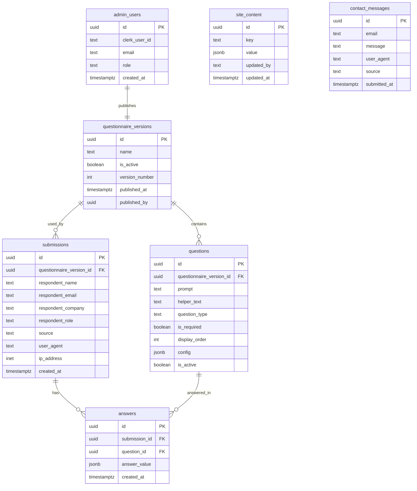

# Database: Supabase

## Purpose

Supabase is the **system of record** for the Bloom Advisors website. It will provide:

- A **Postgres database** for all structured website data (questionnaire, responses, editable site content).
- **Row Level Security (RLS)** policies to enforce public insert-only access and admin-only access where needed.
- Optional: **Storage** for admin-uploaded assets (images/files) if/when required.

## Scope and Responsibilities

**Supabase is responsible for:**

1. **Content Management Data**
    - Storing editable website content shown on the main page (copy, sections, testimonials, CTAs, etc.).
    - Supporting frequent content updates by admins without code changes.
2. **Questionnaire Configuration**
    - Storing questionnaire versions, questions, question ordering, question types, and active/inactive status.
    - Allowing admins to change wording and the number of questions at any time.
3. **Questionnaire Submissions**
    - Storing all visitor responses (no visitor login required).
    - Capturing metadata needed for operational follow-up and analytics (timestamps, page source, optional contact info).
4. **Admin Access Control**
    - Enabling login **only when an "Admin" button is clicked** and the user is routed to an admin page.
    - Restricting admin UI and privileged actions to authorized admin accounts only.
5. **Contact Messages**
    - Storing contact modal submissions (email + message).

**Supabase is NOT responsible for (v1):**

- Advanced marketing analytics attribution (handled by a dedicated analytics tool).
- Customer billing/subscriptions.
- Heavy data warehousing/BI (unless needed later).

## Authentication & Authorization

### Authentication Model

- **Only admins authenticate.**
- Visitors do not create accounts and do not log in.
- Admin login is triggered only when navigating to `/admin` (or equivalent) via an Admin button.

**Note:** Authentication is handled by Clerk, not Supabase Auth. Supabase is used only for data storage and authorization checks via the `admin_users` table. See `docs/decisions/ADR-0006-supabase-access-pattern.md`.

### Authorization Model (RLS)

All sensitive tables must have **RLS enabled** and **policies defined** so only admins can:

- Read/edit site content
- Create/edit questions
- Read submissions and responses
- Access analytics views (if created later)

Public (unauthenticated) access is allowed only where explicitly intended:

- Submitting questionnaire responses (insert-only)
- Submitting contact messages (insert-only)
- Reading public website content (read-only) if content is served from Supabase (or fetched server-side and cached)

**Key design rule:**

- The browser uses the **Supabase anon key** and is constrained by RLS.
- Admin-only access uses server-side API routes with the **service role key** (never exposed to the client).

## Data Model Overview

### Design Goals

- **Flexibility**: Questionnaire questions can change often without schema migrations.
- **Auditability**: Submissions should preserve the questionnaire "snapshot" used when submitted (versioning).
- **Separation of concerns**: Content data, questionnaire config, and submissions are separate domains.

### Proposed Schemas (Postgres)

- `public` (application data): all tables below live here.
- `storage` (managed by Supabase): only used if/when we add file uploads.

## Database Schema Diagram (ERD)

## Table Definitions (What each table does)

### `admin_users`

**Purpose:** Defines which Clerk users are admins and what level of access they have.

- `id` (PK, UUID): primary key
- `clerk_user_id` (text): references Clerk `user.id`
- `email` (text): for audit / clarity
- `role` (text): e.g., `admin` (future: `editor`, `viewer`)
- `created_at` (timestamptz): audit only

**Rationale:** Keeps admin permissions in app-owned schema while identity stays in Clerk.

### `site_content`

**Purpose:** Stores editable content blocks for the main site.

- `id` (PK, UUID): primary key
- `key`: stable identifier (e.g., `homepage.hero`, `homepage.about`, `cta.primary`)
- `value` (JSONB): content payload (text, lists, links, etc.)
- `updated_by` (text): Clerk user ID for audit
- `updated_at` (timestamptz): audit trail

**Rationale:** Lets you change "just about everything" on the main page via admin UI without redeploying.

### `questionnaire_versions`

**Purpose:** Supports frequent changes by versioning the questionnaire.

- `id` (PK, UUID): primary key
- `name` (text): human-readable version name
- `is_active` (boolean): one version is `is_active = true`
- `version_number` (int): increments when publishing a new questionnaire
- `published_at` (timestamptz): when this version went live
- `published_by` (uuid): Clerk user ID who published it

**Rationale:** Avoids breaking historical submissions when questions change.

### `questions`

**Purpose:** Stores the questions for a given version.

- `id` (PK, UUID): primary key
- `questionnaire_version_id` (FK, UUID): references `questionnaire_versions.id`
- `prompt` (text): the question text
- `helper_text` (text): optional help text
- `question_type` (text): e.g., `short_text`, `long_text`, `multiple_choice`, `multi_select`, `number`, `date`
- `is_required` (boolean): whether the field must be filled
- `display_order` (int): controls ordering
- `config` (JSONB): flexible per-type config (choices, min/max, placeholder, etc.)
- `is_active` (boolean): allows hiding without deleting

**Rationale:** Maximum flexibility without schema changes.

### `submissions`

**Purpose:** Represents one completed questionnaire submission.

- `id` (PK, UUID): primary key
- `questionnaire_version_id` (FK, UUID): references the version used
- Contains optional contact fields (if you collect them)
- Stores metadata like `source`, `user_agent`, and optionally `ip_address`
- `created_at` (timestamptz): submission timestamp

**Rationale:** A single record per submission makes it easy to list/filter in the admin UI.

### `answers`

**Purpose:** Stores answers per question per submission.

- `id` (PK, UUID): primary key
- `submission_id` (FK, UUID): references `submissions.id`
- `question_id` (FK, UUID): references `questions.id`
- `answer_value` (JSONB): supports any question type cleanly
- `created_at` (timestamptz): answer timestamp

**Rationale:** Avoids adding columns every time you add/change questions.

### `contact_messages`

**Purpose:** Stores contact modal submissions.

- `id` (PK, UUID): primary key
- `email` (text): contact email
- `message` (text): contact message
- `user_agent` (text): optional metadata
- `source` (text): optional page or campaign source
- `submitted_at` (timestamptz): submission timestamp

**Rationale:** Keeps contact form data in Supabase with the same privacy model as questionnaire submissions.
See `docs/decisions/ADR-0008-contact-form-storage.md`.

## Security Model (RLS Policy Requirements)

### Public access rules (unauthenticated users)

- **Allowed:** `INSERT` into `submissions` and `answers` (for form submission).
- **Allowed:** `INSERT` into `contact_messages`.
- **Not allowed:** `SELECT`, `UPDATE`, `DELETE` on submissions/answers/contact messages (prevents data leaks).

### Admin access rules (authenticated admins)

Admins can:

- `SELECT/INSERT/UPDATE/DELETE` on:
    - `site_content`
    - `questionnaire_versions`
    - `questions`
    - `submissions`
    - `answers`
    - `contact_messages`

Admin access is enforced by the application layer and executed server-side using the service role key (see `docs/decisions/ADR-0006-supabase-access-pattern.md`).

**Admin check pattern (conceptual):**

- A user is an admin if a row exists in `admin_users` where:
    - `clerk_user_id` matches the authenticated Clerk user ID
    - (No `is_active` check needed in V1, but can be added later)

## Implementation Approach

### Frontend / Admin UX Flow

- Main site is public.
- Admin access begins when user clicks **Admin** and is routed to `/admin`.
- `/admin` page checks auth state:
    - If not signed in → show Clerk Auth UI
    - If signed in but not admin → show "Access denied"
    - If signed in and admin → show admin dashboard

### Data Access Patterns

- Public main site:
    - Reads content either:
        - server-side (recommended for security + performance), or
        - via public read policies if content is safe to expose
- Questionnaire submit:
    - Inserts submission, then inserts answers (transaction-like behavior; if needed later, wrap with a server route)

## Non-Functional Requirements

- **Auditability:** log `updated_by` + timestamps on content changes.
- **Data retention:** decide retention policy for IP/user agent (privacy).
- **Environments:** plan for at least `development` and `production` Supabase projects.
- **Migrations:** schema changes should be tracked (SQL migrations or Supabase CLI).
